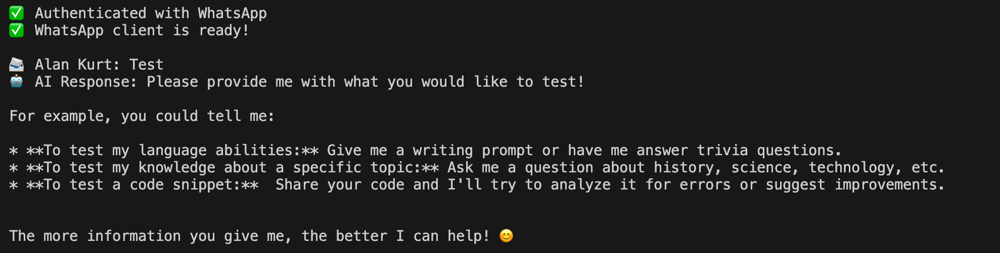

# 🤖 Ollama Gemma-2-2b Chatbot for Raspberry Pi 5

**You can talk to your AI from your WhatsApp app in a private manner, no APIs to third parties like OpenAI.**


A dockerized chatbot running Google's Gemma-2-2b model on Raspberry Pi 5, with FastAPI wrapper and WhatsApp integration.

---

## 📑 Table of Contents

- [📋 Overview](#-overview)
- [🏗️ Architecture](#️-architecture)
- [🚀 Quick Start](#-quick-start)
  - [Prerequisites](#prerequisites)
- [📦 Deployment Workflow](#-deployment-workflow)
  - [Step 1: Build on Your Mac](#step-1-build-on-your-mac)
  - [Step 2: One-Time Setup on Raspberry Pi](#step-2-one-time-setup-on-raspberry-pi)
- [🔐 Security & Authorization](#-security--authorization)
  - [How to Configure Your Phone Number](#how-to-configure-your-phone-number)
- [💬 WhatsApp Usage & Customization](#-whatsapp-usage--customization)
- [🧠 Context-Aware Group Conversations](#-context-aware-group-conversations)
- [🛡️ Anti-Spam & Abuse Protections](#️-anti-spam--abuse-protections)
- [🎨 Customizing WhatsApp Filters](#-customizing-whatsapp-filters)
- [🐛 Troubleshooting](#-troubleshooting)
- [🧪 Testing](#-testing)
- [🌐 API Documentation](#-api-documentation)
- [🔧 Useful Commands](#-useful-commands)
- [📊 Resource Usage](#-resource-usage)
- [🔄 CI/CD Pipeline](#-cicd-pipeline)
- [📚 Tech Stack](#-tech-stack)
- [💡 Tips](#-tips)

---

## 📋 Overview

This project provides a complete setup for running a local AI chatbot on Raspberry Pi 5 with:
- **Ollama** - Runs the Gemma-2-2b LLM (or any other model you choose)
- **FastAPI** - REST API wrapper for easy integration
- **WhatsApp Integration** - Chat with your AI via WhatsApp (no public exposure needed!)
- **Docker** - Containerizes components for easy deployment

**🎨 Want to customize your AI?** Check out the **[CUSTOMIZATION_GUIDE.md](CUSTOMIZATION_GUIDE.md)** to learn how to:
- Change the AI's personality (system prompt)
- Switch to different models (LLaMA, Mistral, Phi, etc.)
- Understand why we use `/var/www` and better alternatives

## 🏗️ Architecture

```
You → WhatsApp → WhatsApp Bridge (Port 3000) → FastAPI (Port 8000) → Ollama (Port 11434) → Gemma-2-2b
                  (Node.js)                       (Python)              (LLM Engine)
```

**Everything runs locally on your Pi - no public exposure needed!**

## 🚀 Quick Start

### Prerequisites

**On Your local machine (Build Machine):**
- Docker Desktop with buildx enabled
- Docker Hub account (logged in: `docker login`)
- Git

**On Raspberry Pi (mine is the model 5):**
- Raspberry Pi OS (64-bit)
- Docker installed
- Docker Compose installed
- 8GB RAM (minimum 4GB)
- Watchtower running (for auto-updates)

---

## 📦 Deployment Workflow

### Step 1: Build on Your Mac

1. **Clone the repository**
   ```bash
   git clone git@github.com:gonzalo-munillag/RPI_Chatbot.git
   cd RPI_Chatbot
   ```

2. **Edit files with your Docker Hub username**
   
   Edit build script:
   ```bash
   nano build-and-push.sh
   ```
   Replace `gonzalomg0` with YOUR Docker Hub username.
   
   Edit docker-compose:
   ```bash
   nano docker-compose.yml
   ```
   Replace `gonzalomg0` with YOUR Docker Hub username.

3. **Build and push to Docker Hub**
   ```bash
   ./build-and-push.sh
   ```
   
   This will:
   - Build for ARM64 (Raspberry Pi) and AMD64 (Mac)
   - Push to Docker Hub
   - Take 10-15 minutes on first build, Gemma 2 - 2b takes around 1.5-2GB of space

---

### Step 2: One-Time Setup on Raspberry Pi

1. **SSH into your Raspberry Pi**
   ```bash
   ssh user@your-pi-address
   ```

2. **Create project folder in /var/www** (that's where web projects are usually stored, this comes from Linux web server conventions (Apache, Nginx). Not necessaroly where this one should be...)
   ```bash
   sudo mkdir -p /var/www/ollama_chatbot
   cd /var/www/ollama_chatbot
   ```

3. **Copy docker-compose.yml to Pi**
   
   **Option A - Copy to home, then move:**
   ```bash
   # On your Mac
   scp docker-compose.yml user@your-pi-ip:~/
   
   # On Pi
   sudo mv ~/docker-compose.yml /var/www/ollama_chatbot/
   ```
   
   **Option B - Copy-paste with nano:**
   ```bash
   # On Pi
   sudo nano /var/www/ollama_chatbot/docker-compose.yml
   # Paste the content from your Mac
   ```

4. **Start the services**
   ```bash
   sudo docker-compose up -d
   ```

5. **Check if container is running**
   ```bash
   docker-compose ps
   docker logs ollama-gemma -f
   ```
   
   **Note:** First startup takes 5-10 minutes to download the Gemma-2-2b model (~1.6GB)

6. **Get a Second Phone Number for WhatsApp Bot**

   **Why you need this:** WhatsApp Web (at least the client set up here) doesn't receive messages from the same account. You need a separate phone number for the bot.

   ### eSIM (Easiest, €4-10)
   
   **Recommended:** [Airalo](https://www.airalo.com) - Digital eSIM provider
   
   1. **Download Airalo app** on your phone (iOS/Android)
   2. **Create account** and browse eSIM plans
   3. **Install the eSIM** on your phone (if you follow the app's user flow it will do it for you)
      - iPhone: Settings → Cellular → Add eSIM
      - Android: Settings → Network → SIM cards → Add eSIM
   6. **Install WhatsApp Business** (separate from regular WhatsApp)
   7. **Verify with the eSIM number:** Just input the new phone number into WhatsApp for business prompt. I did not receive an SMS to verify, so I chose a call instead. A WhatsApp bot called me and recited the verification code. 
   
   **Advantages:**
   - ✅ No physical SIM card needed
   - ✅ Instant activation
   - ✅ Keep both on same phone
   - ✅ Can use WhatsApp Business with eSIM number
   
7. **Connect WhatsApp (Detailed Steps)**

   ### Prerequisites on Pi:
   - Docker and Docker Compose installed ✅
   - Container running: `docker ps` should show `ollama-gemma` and `whatsapp-bridge`
   - SSH access working
   - **Second phone number registered on WhatsApp Business**
   
   ### View QR Code:

   SSH into your Pi and run:
   ```bash
   sudo docker logs whatsapp-bridge -f
   ```
   
   You'll see the QR code displayed in the terminal. Keep this terminal open for the next step.
   
   ### Scan the QR Code with WhatsApp Business:
   
   Once you can see the QR code in the terminal:
   
   1. **Open WhatsApp Business** on your phone (with the eSIM/second number)
   2. **Android:** Tap ⋮ (three dots) → **Linked Devices**
      **iPhone:** Tap **Settings** → **Linked Devices**
   3. Tap **Link a Device**
   4. **Scan the QR code** displayed in your browser
   5. **Wait 5-10 seconds** - Page will show "✅ WhatsApp Connected!"
   6. **The bot is now linked!** Your personal WhatsApp can now message the bot's number
   
   ### Test the Bot:
   
   1. **Add the bot's number to your contacts** in your personal WhatsApp
   2. **Send a message** from your personal WhatsApp to the bot's number:
      ```
      What is the capital of France?
      ```
   3. **Wait for response** (may take 30-60 seconds for first message while model loads)
   
   **For Group Chats:**
   - Add the bot to any group
   - Use the trigger word: `Prometheus what is the capital of France?`
   - **The bot will only respond to messages from you that start with "Prometheus"**
   
   **Note:** Subsequent responses are faster (5-30 seconds).
   
   
   *Example of a successful conversation with the AI bot*
   
   ### Troubleshooting QR Code Access:
   
   **Can't see QR code?**
   ```bash
   # On Pi - check if container is running
   docker ps | grep ollama-gemma
   
   # Check logs for errors
   docker logs ollama-gemma -f
   
   # Look for this line in logs:
   # "WhatsApp Bridge running on port 3000"
   ```
   
   **SSH tunnel not working?**
   - Make sure port 3000 isn't already in use on your Mac: `lsof -i :3000`
   - Try a different port: `ssh -L 3001:localhost:3000 user@pi` then visit `http://localhost:3001/qr`
   - Check Pi firewall: `sudo ufw status` (should show inactive or allow SSH)
   
   **QR code expired?**
   - Refresh the page: `http://localhost:3000/qr`
   - QR codes expire after a few minutes for security
   
   **Container keeps restarting?**
   ```bash
   # Check what's wrong
   docker logs ollama-gemma --tail 50
   
   # Common issue: Out of memory (need at least 4GB RAM)
   free -h
   ```

---

### 💬 WhatsApp Usage & Customization

**Features:**
- ✅ Works in personal chats
- ✅ Shows typing indicator while thinking
- ✅ Persistent session (no re-scan after restart)
- ✅ 2-minute timeout per message
- ⏱️ Responses take 5-30 seconds (Gemma on Pi is slower)

**Security:**
- 🔒 Port 3000 is bound to localhost only (can't be accessed from network)
- 🔒 WhatsApp session is stored in encrypted Docker volume
- 🔒 Only authorized user (by phone number + internal ID) can trigger the bot
- 🔒 Group messages require "Prometheus" trigger word
- 🔒 Rate limiting prevents spam (from my end, since I am the only one able to trigger responses; but could be extended to trusted entities and increase cooldown) (2 second cooldown)
- 🔒 Message length limits prevent overflow
- 🔒 Context isolation per group (see below)

---

### 🧠 Context-Aware Group Conversations

**Prometheus "Listens" to Group Conversations**

The bot stores recent messages from group chats to provide context-aware responses. However, it **only responds to you**.

#### How It Works:

```
Alice: "The weather is great today!"
Bob: "Yeah, perfect for a picnic"
Charlie: "Should we go to the park?"

You: "Prometheus what are they planning?"
AI: "Based on the conversation, Alice mentioned the weather is great, and they're discussing going to the park for a picnic."
```

**Key Features:**
- ✅ **Stores last 15 messages** per group (memory efficient)
- ✅ **Sends only 5 messages** to AI (stays within token limits)
- ✅ **Prioritizes your direct question** over context
- ✅ **Completely isolated per group** - E.g. family group context never mixes with Work group context
- ✅ **Automatic cleanup** - Context cleared on container restart

#### Conversation Compartmentalization

Each group has its **own isolated context storage**:

```
Family Group (ID: abc123@g.us)
  └─ [Last 15 messages from family]
  
Work Group (ID: xyz789@g.us)
  └─ [Last 15 messages from work]
  
Friends Group (ID: def456@g.us)
  └─ [Last 15 messages from friends]
```

When you ask Prometheus a question in the Family group, it **only** sees Family group messages. Work and Friends contexts are completely separate and never mixed.

**Privacy Note:** 
- Context stored in memory only (RAM)
- Not saved to disk
- Cleared when container restarts
- Max 50 groups tracked (memory protection)

---

### 🛡️ Anti-Spam & Abuse Protections

The bot includes multiple layers of protection to prevent malfunction and abuse:

#### Protection 1: Message Length Limits ✂️

```
MAX_MESSAGE_LENGTH = 500 characters per message
```

**What it does:**
- Truncates any message longer than 500 characters
- Adds `... [truncated]` indicator
- Prevents token overflow

**Example:**
```
User sends 2,000 character essay
Stored as: [First 500 chars]... [truncated]
```

#### Protection 2: Rate Limiting ⏱️

```
RATE_LIMIT = 2 seconds between requests
```

**What it does:**
- You must wait 2 seconds between AI requests
- Prevents rapid-fire spam
- Bot replies: "⏱️ Please wait X seconds"

**Example:**
```
10:00:00 - "Prometheus hi" ✅ Responds
10:00:01 - "Prometheus hi" ❌ "Please wait 1 second"
10:00:02 - "Prometheus hi" ✅ Responds
```

#### Protection 3: Context Limits 📊

```
MAX_CONTEXT_MESSAGES = 15  (stored per group)
MAX_CONTEXT_TO_SEND = 5    (sent to AI)
```

**Token Budget:**
- 5 messages × 500 chars = 2,500 characters
- ~750-1,000 tokens for context
- Total usage: ~20-25% of Gemma-2-2b's 8K token limit
- **Safe buffer** to prevent context overflow

#### Protection 4: Group Limits 🏘️

```
MAX_GROUPS = 50 groups
```

**What it does:**
- Tracks context for maximum 50 groups
- 51st group won't store context (but bot still responds to you)
- **Memory protection** prevents RAM from growing unbounded

#### Protection 5: Priority System 🎯

The AI **always prioritizes your direct question** over context:

```
Context: Alice, Bob, Charlie talking about weather
You: "Prometheus what is the latin name for earth?"
AI: Ignores weather context, answers: "Terra"
```

---

### 🎨 Customizing WhatsApp Filters

The bot's behavior is controlled by `whatsapp-bridge/index.js`. Here's how to customize it:

#### Change the Trigger Word (Groups)

Find this line in `whatsapp-bridge/index.js`:

```javascript
if (!message.body.startsWith('Prometheus')) {
```

Replace `'Prometheus'` with your preferred trigger word:
```javascript
if (!message.body.startsWith('Hey AI')) {  // Your custom trigger
```

#### Add Multiple Authorized Users

Currently, the bot only responds to one user. To add more users:

1. **Find their internal IDs** by watching the logs when they send a message
2. **Modify the authorization check** in `index.js`:

```javascript
// Replace this:
const isAuthorized = (senderNumber === AUTHORIZED_NUMBER) || (senderNumber === AUTHORIZED_LID);

// With this:
const AUTHORIZED_USERS = [
    process.env.AUTHORIZED_NUMBER,
    process.env.AUTHORIZED_LID,
    'FRIEND_NUMBER@c.us',
    'FRIEND_LID@lid'
];
const isAuthorized = AUTHORIZED_USERS.includes(senderNumber);
```

#### Make Bot Respond to All Group Members

To make the bot respond to everyone in a group (not just you):

```javascript
// Replace this:
if (!isAuthorized) {
    if (chat.isGroup) {
        console.log(`   ❌ Not authorized user - ignoring`);
    }
    return;
}

// With this:
if (chat.isGroup && !message.body.startsWith('Prometheus')) {
    return;  // Only check for trigger word, not user
}
```

#### Disable Group Trigger Word

To make the bot respond to all your messages in groups (without needing "Prometheus"):

```javascript
// Remove or comment out these lines:
if (chat.isGroup) {
    if (!message.body.startsWith('Prometheus')) {
        console.log(`   ❌ Missing "Prometheus" trigger - ignoring`);
        return;
    }
    message.body = message.body.substring('Prometheus'.length).trim();
}
```

**After making changes:**
1. Rebuild the Docker image: `./build-and-push.sh`
2. Watchtower will auto-deploy in ~5 minutes, or manually restart: `sudo docker-compose restart whatsapp`

---

### 🐛 Troubleshooting

**QR code not showing?**
```bash
sudo docker logs whatsapp-bridge -f
```

**WhatsApp disconnects or Chromium profile locked?**

This happens when containers restart rapidly. Fix:
```bash
# Remove session and re-scan
cd /var/www/ollama_chatbot
sudo docker-compose down
sudo docker volume rm ollama_chatbot_whatsapp-data
sudo docker-compose up -d
# Access QR code again and re-scan with WhatsApp Business
```

**Bot not responding to group messages?**

Check if your internal ID (`@lid`) is configured:
```bash
# Watch the logs
sudo docker logs whatsapp-bridge -f

# Send a group message, look for:
#   Sender: 98765432109@lid    ← Your LID
#   Authorized LID: YOUR_LID_HERE@lid  ← Should match!
```

If it shows `YOUR_LID_HERE@lid`, you need to update your `.env` file (see "Find your internal ID" section above).

**Bot not responding at all?**
```bash
# Check if services are running
docker ps
curl http://localhost:8000/health
curl http://localhost:3000/health

# Check logs for errors
sudo docker logs ollama-gemma -f
sudo docker logs whatsapp-bridge -f
```

**Container keeps restarting?**
```bash
# Check what's wrong
docker logs whatsapp-bridge --tail 50

# Common issue: .env file not loaded
ls -la /var/www/ollama_chatbot/.env

# If missing, copy it from your Mac again
```

## 🔐 Security & Authorization

This bot is configured with **strict authorization controls**:

- **Phone Number Authorization**: Only responds to messages from YOUR specific WhatsApp phone number (not name-based, so completely unique)
- **Dual ID System**: Uses both your regular phone number (`@c.us`) for direct chats AND your internal WhatsApp ID (`@lid`) for group chats
- **Group Trigger Word**: In group chats, only responds when you start your message with "Prometheus" (you can change the trigger word name of your AI; I used the name of a character in my sci-fi epic _GÖD'S GATE_)
- **Private Conversations**: In direct chats, responds to all your messages

**Why phone number instead of name?**
- ✅ Names can be duplicated (multiple people named "John" in groups)
- ✅ Phone numbers are unique identifiers
- ✅ No one can impersonate you even with the same name

**Why two IDs (phone number + internal ID)?**
- WhatsApp uses different identifier formats in different contexts
- Direct chats use `@c.us` format (your phone number)
- Group chats use `@lid` format (WhatsApp's internal ID)
- Both IDs are _you_ - just different formats

**Example Usage:**
- Direct chat: "What is the capital of France?" → AI responds
- Group chat: "Prometheus what is the capital of France?" → AI responds
- Group chat: "What is the capital of France?" → AI ignores (no "Prometheus" prefix)
- Anyone else in the group (even with your name) messages the bot → AI ignores completely

⚠️ **IMPORTANT WARNING**: If you use your **personal WhatsApp account** (not a separate WhatsApp Business number) to initialize the bot, the AI will respond to **ALL incoming messages** as if it were you. Meta/WhatsApp will not detect this. **This is why I strongly recommend using a separate phone number for the bot.** Unless you want to ruin all your relationships :D

### How to Configure Your Phone Number

Your phone numbers are stored securely in a `.env` file that's excluded from GitHub:

1. **Format your phone number:**
   - Take your number with country code: `+49 598 65 85 32`
   - Remove `+` and spaces: `49598658532`
   - Add `@c.us` at the end: `49598658532@c.us`

2. **Create your .env file:**
   ```bash
   # Copy the example file
   cp .env.example .env
   
   # Edit with your configuration
   nano .env
   ```
   
   The `.env` file contains:
   ```bash
   # Required - WhatsApp Authorization
   AUTHORIZED_NUMBER=YOUR_NUMBER_HERE@c.us
   AUTHORIZED_LID=YOUR_LID_HERE@lid
   
   # Optional - AI Configuration (see CUSTOMIZATION_GUIDE.md)
   MODEL_NAME=gemma2:2b
   SYSTEM_PROMPT=You are Prometheus, a helpful AI assistant...
   ```
   
   Replace:
   - `YOUR_NUMBER_HERE@c.us` with your phone number (e.g., `49598658532@c.us`)
   - `YOUR_LID_HERE@lid` - Leave as placeholder for now (you'll find this after first group message)
   - `MODEL_NAME` and `SYSTEM_PROMPT` - Optional, use defaults or customize (see [CUSTOMIZATION_GUIDE.md](CUSTOMIZATION_GUIDE.md))

3. **Copy .env to your Pi:**
   ```bash
   # On your Mac
   scp .env user@your-pi-ip:~/
   
   # On Pi
   sudo mv ~/.env /var/www/ollama_chatbot/.env
   ```

4. **Find your internal ID (for group chats):**
   
   After the bot is running:
   
   ```bash
   # On Pi - watch the logs
   sudo docker logs whatsapp-bridge -f
   ```
   
   Send a message in a group (with or without "Prometheus"). You'll see:
   ```
   🔍 Group message received:
      Group: My Test Group
      Sender: 98765432109@lid    ← This is your LID!
      Authorized Phone: 49598658532@c.us
      Authorized LID: YOUR_LID_HERE@lid
   ```
   
   Copy that `Sender` value (e.g., `98765432109@lid`) and update your `.env`:
   ```bash
   # On Pi
   nano /var/www/ollama_chatbot/.env
   ```
   
   Replace `YOUR_LID_HERE@lid` with your actual LID, save (Ctrl+X, Y, Enter), then:
   ```bash
   sudo docker-compose restart whatsapp
   ```

5. **Your numbers are now secure:**
   - ✅ `.env` is in `.gitignore` (never pushed to GitHub)
   - ✅ Docker reads it from the environment
   - ✅ No hardcoded credentials in your code 


## 🧪 Testing

### Test the FastAPI endpoints

1. **Health check**
   ```bash
   curl http://localhost:8000/health
   ```

2. **List models**
   ```bash
   curl http://localhost:8000/models
   ```

3. **Send a chat message**
   ```bash
   curl -X POST http://localhost:8000/chat \
     -H "Content-Type: application/json" \
     -d '{
       "message": "What is the capital of France?",
       "temperature": 0.7,
       "max_tokens": 100
     }'
   ```

### Expected Response:
```json
{
  "response": "The capital of France is Paris...",
  "model": "gemma2:2b",
  "done": true
}
```

---

## 🌐 API Documentation

### Endpoints

#### `GET /`
- **Description:** API status and available endpoints
- **Response:** JSON with API information

#### `GET /health`
- **Description:** Health check for both FastAPI and Ollama
- **Response:** 
  ```json
  {
    "status": "healthy",
    "fastapi": "running",
    "ollama": "running"
  }
  ```

#### `GET /models`
- **Description:** List available models in Ollama
- **Response:** List of installed models

#### `POST /chat`
- **Description:** Send a message to the chatbot
- **Request Body:**
  ```json
  {
    "message": "Your question here",
    "stream": false,
    "temperature": 0.7,
    "max_tokens": 500
  }
  ```
- **Response:**
  ```json
  {
    "response": "AI response here",
    "model": "gemma2:2b",
    "done": true
  }
  ```

**Parameters:**
- `message` (required): Your question/prompt
- `stream` (optional): Stream response word-by-word (default: false)
- `temperature` (optional): Creativity 0.0-1.0 (default: 0.7)
- `max_tokens` (optional): Max response length (default: 500)

---

## 🔧 Useful Commands

### On Your Mac (Build Machine)

```bash
# Rebuild and push new version
./build-and-push.sh

# Build without pushing (testing)
docker build --platform linux/arm64 -t test-image .
```

### On Raspberry Pi

```bash
# View logs
docker-compose logs -f

# Restart service
docker-compose restart

# Stop service
docker-compose down

# Stop and remove volumes (deletes model)
docker-compose down -v

# Pull latest image
docker-compose pull

# Update and restart
docker-compose pull && docker-compose up -d

# Check container status
docker-compose ps

# Enter container shell (debugging)
docker exec -it ollama-gemma /bin/bash
```

---

## 📊 Resource Usage

**Expected on Raspberry Pi 5 (8GB RAM):**
- **RAM:** ~3-4GB (model loaded)
- **Disk:** ~2GB (Docker image + model)
- **CPU:** Varies by usage (idle is minimal)

---

## 🐛 Troubleshooting

### Container won't start
```bash
# Check logs
docker-compose logs

# Common issues:
# - Out of memory: Gemma-2-2b needs at least 3GB RAM
# - Port conflict: Check if ports 8000/11434 are in use
```

### Model download fails
```bash
# Check internet connection
# Manually pull model:
docker exec -it ollama-gemma ollama pull gemma2:2b
```

### API not responding
```bash
# Check if both services are running
curl http://localhost:11434/api/tags  # Ollama
curl http://localhost:8000/health      # FastAPI
```

### Health check failing
```bash
# Wait 60 seconds after startup (model download time)
# Check logs for errors:
docker-compose logs -f
```

---


## 🔄 CI/CD Pipeline

**Current Setup:**
1. **Your Mac** - Build multi-arch images
2. **Docker Hub** - Image registry
3. **Raspberry Pi** - Watchtower auto-pulls updates

**Workflow:**
```
Code Change → build-and-push.sh → Docker Hub → Watchtower (checks every 5 min) → Auto-Deploy
```

**How Watchtower Works:**
- Monitors running containers
- Checks Docker Hub every 5 minutes for image updates
- Compares image digest (hash) to detect new versions
- Automatically pulls, stops, and restarts with new image
- Cleans up old images

**Check if Watchtower is running:**
```bash
docker ps | grep watchtower
```

---

## 📚 Tech Stack

- **Ollama** - LLM runtime
- **Gemma-2-2b** - Google's 2B parameter model
- **FastAPI** - Python web framework
- **Uvicorn** - ASGI server
- **Docker** - Containerization
- **Docker Buildx** - Multi-architecture builds
- **Cloudflare Tunnel** - Secure external access

---

## 💡 Tips

- **First startup is slow** - Model download takes time
- **Be patient** - Gemma-2-2b can take 5-30 seconds per response on Pi
- **Monitor RAM** - Use `docker stats` to check resource usage
- **Persistent storage** - Model is downloaded once and persists
- **Auto-restart enabled** - Service survives Pi reboots

---

**Enjoy your self-hosted AI chatbot!** 🚀

